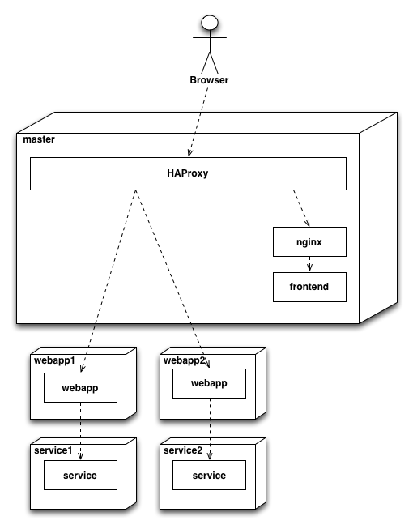

# service-discovery-workshop



Initial setup
-------------

Start five virtual servers with

```bash
vagrant up
```

Start a consul server on the master node

```bash
vagrant ssh master
nohup consul agent -server -bootstrap-expect 1 -data-dir /tmp/consul -config-dir /etc/consul.d/ -ui-dir /opt/consul-web/ -bind 172.20.100.2 -client 0.0.0.0 -node master &
```

Start a consul agent on an all the application nodes, and connect it to the master

Have a look at the Web UI on http://localhost:8500/ui

```bash
### Setup service1
vagrant ssh service1
nohup consul agent -data-dir /tmp/consul -config-dir /etc/consul.d/ -bind 172.20.100.5 -node service1 &
sleep 2 # Wait for consul to start
consul join 172.20.100.2
consul members # list all members in the cluster
exit

# Setup service2
vagrant ssh service2
nohup consul agent -data-dir /tmp/consul -config-dir /etc/consul.d/ -bind 172.20.100.6 -node service2 &
sleep 2 # Wait for consul to start
consul join 172.20.100.2
consul members # list all members in the cluster
exit

# Setup webapp1
vagrant ssh webapp1
nohup consul agent -data-dir /tmp/consul -config-dir /etc/consul.d/ -bind 172.20.100.7 -node webapp1 &
sleep 2 # Wait for consul to start
consul join 172.20.100.2
consul members # list all members in the cluster
exit

# Setup webapp2
vagrant ssh webapp2
nohup consul agent -data-dir /tmp/consul -config-dir /etc/consul.d/ -bind 172.20.100.8 -node webapp2 &
sleep 2 # Wait for consul to start
consul join 172.20.100.2
consul members # list all members in the cluster
exit
```

## 1. Register services

The first exercise is to register our webapplications serving API for our
frontend. We will use [Consul's service
files](https://www.consul.io/intro/getting-started/services.html). The
`/etc/consul.d` directory is already present.

Register the webapp using the JSON file. The application is running on port
8080. The file must be created on the node the application is running on. After
creating the file, run `consul reload` on the node, to make consul re-read the
`/etc/consul.d`-directory.

Use `vagrant ssh webapp1` and `vagrant ssh webapp2` to connect to the two
servers running the application.

You should also start the application by running `backend.sh start` inside the
VM.

Use the [Consul Web
API](https://www.consul.io/docs/agent/http/catalog.html#catalog_services) to
query and check if your services has been registered. The easiest way is to use
curl from inside one of the application servers. If you called you service
`backend`, the command should be: `curl
http://localhost:8500/v1/catalog/service/backend`

We also also installed Consul UI for you. Open a browser on
(http://localhost:8500/) to see you registered service.

We have set up HAProxy to serve the application using a static config. We will
be using the registered service later. For now you can go to
(http://localhost:8888/) to see that the application works.

## 2. Registering services through API

There are two ways of registering a service in Consul. In the first task we
registered a service with a JSON file. The other way use to register a service
is with the [Consul
API](https://www.consul.io/docs/agent/http/catalog.html#catalog_register)

Try using the smallest JSON file you can use. We do not use a healthcheck at
this time.

You can get the ipaddress of the server by running `ifconfig` on the server.
Use the address starting with `172.20.100.`.

Use the Consul API to register the services running on `service1` and
`service2`. A tip is to log in to one of them and put the JSON into a file, and
use curl to call the API. Example below: `-d` sends the data in `filename.json`
as the HTTP body.

```bash
curl -X PUT -d @filename.json http://localhost:8500/v1/catalog/register
```

Check that the services has been registered correctly.

## 3. Using consul-template

Our webapp-backend is going to talk to another service. To know the URL of this
service, the webapp-backend reads `config.properties`, and put in
`service.url=` with a comma-seperated list of URLs. The app reloads this file
automatically.

To create this file we are going to use a tool called
[consule-template](https://github.com/hashicorp/consul-template#usage). The
default configuration for consul-template is fine, so no need to create a
configuration file. The program will watch for changes in the consul cluster,
and write a new file based on template after each change. That way our
application can read that file, and always have up-to-date URLs to call.

The template files are written as [Go-template with some
extensions](https://github.com/hashicorp/consul-template#templating-language)

By adding `-` when printing variables in the template, you also remove
whitespace. `{{- .Address }}` will remove the whitespace and newlines before
the variable, and `{{ .Address -}}` will remove after. To create a comma
seperated list, see the tip in the [Stackoverflow
answer](http://stackoverflow.com/a/21305933)

The [service-command](https://github.com/hashicorp/consul-template#service)
will list out all the IP-s and ports for a given service. Use this to iterate
through the nodes. The `range`-command is useful to iterate over the values.

Use consule-template to create the `config.properties` file, and with the
property `service.url=` with IP and and port in a comma separeted list.
Example of a rendered file:

```
# config.properties
service.url=172.20.100.5:8080,172.20.100.6:8080
```

You have now connected the tag service to our application. Go to
(http://localhost:8888/) to see that that you can add tags to to-do's. You can
also check in the bottom which service the application is using. Refreshing a
couple of times should change this address.

# The backend

Run ```curl http://localhost:8080/backend/info``` on webapp1 and webapp2 to check if they are running.


# Healthchecks

All apps configured with health endpoints

curl http://localhost:8081/manage/health
